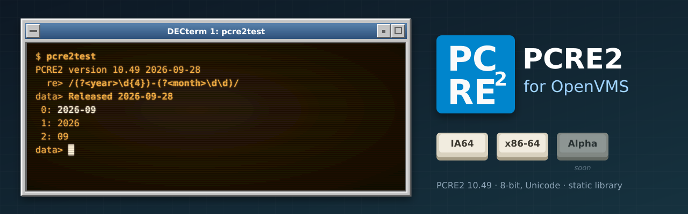

<p align="center">
  
</p>

# PCRE2 for OpenVMS

A port of the [PCRE2](https://github.com/PCRE2Project/pcre2) regular-expression library (10.49) to
OpenVMS on **IA64** and **x86-64**, kept as a thin layer over the official release. Its first user
is [GNU grep for OpenVMS](https://github.com/issinoho/vms-grep), where it provides `grep -P`. It
belongs to the same family as [GNU grep](https://github.com/issinoho/vms-grep),
[GNU sed](https://github.com/issinoho/vms-sed), [GNU awk](https://github.com/issinoho/vms-awk),
[GNU make](https://github.com/issinoho/vms-make),
[GNU diffutils](https://github.com/issinoho/vms-diffutils),
[GNU patch](https://github.com/issinoho/vms-patch), [GNU m4](https://github.com/issinoho/vms-m4),
[GNU Bison](https://github.com/issinoho/vms-bison), [flex](https://github.com/issinoho/vms-flex),
[GNU Wget](https://github.com/issinoho/vms-wget), [curl](https://github.com/issinoho/vms-curl),
[zlib](https://github.com/issinoho/vms-zlib), [bzip2](https://github.com/issinoho/vms-bzip2),
[XZ Utils](https://github.com/issinoho/vms-xz) and [Zstandard](https://github.com/issinoho/vms-zstd)
for OpenVMS.

Like vms-grep, this repository holds **only our changes**. Every build starts from the
signed release tarball, which is verified against the PCRE2 maintainer's key in `keys/`.
It then applies our patches, adds our VMS-only files, and generates the configuration for
VSI C.

## Status

| | IA64 | x86-64 |
|---|---|---|
| Library (8-bit, Unicode, no JIT) builds with MMS | yes | yes |
| `pcre2test` test suites (8-bit, no JIT) | 23 pass, 0 fail | 23 pass, 0 fail (1 expected: locale data) |
| Used by grep for `grep -P` ([v3.12-vms3](https://github.com/issinoho/vms-grep/releases/tag/v3.12-vms3)) | yes | yes |
| Clang (LP64) build for programs compiled with clang (`BUILD ALL "" CLANG`) | n/a | builds; tests 21 pass, 2 fail (see below) |
| PCSI kit ([v10.49-vms1](https://github.com/issinoho/vms-pcre2/releases/tag/v10.49-vms1)) | `ISSINOHO-I64VMS-PCRE2-V1049-1-1.PCSI` | `ISSINOHO-X86VMS-PCRE2-V1049-1-1.PCSI` |

## What gets built

- **`PCRE2-8.OLB`:** the 8-bit library as an object library, for static linking into
  programs such as grep.
- **`PCRE2-POSIX.OLB`:** PCRE2's POSIX-style wrapper (`regcomp`/`regexec` as
  `pcre2_regcomp`/`pcre2_regexec`), used together with `PCRE2-8.OLB`.
- **`PCRE2TEST.EXE`:** PCRE2's test program, used to run the upstream test data on VMS.
- **An install tree** (`[.INSTALL_<arch>]`, with `[.INCLUDE]` holding `PCRE2.H` and
  `PCRE2POSIX.H`, and `[.LIB]` holding both libraries): this is what other ports build
  against.
- **A PCSI kit** (`[.KIT_<arch>]`), which installs the same files system-wide.

**Clang (LP64) build (x86-64):** VSI C is ILP32 (`long` and pointers 32-bit) and VSI C++'s
clang is LP64, so objects from the two cannot be mixed. `@[.VMS]BUILD ALL "" CLANG` (or
`tools/build.sh x86 ALL "" CLANG`) compiles the same sources with clang into
`[.OBJ_X86_64_CLANG]`, `[.BIN_X86_64_CLANG]` and the install tree `[.INSTALL_X86_64_CLANG]`
(flags in `overlay/vms/config/clangflags.txt`). Its first user is
[MariaDB for OpenVMS](https://github.com/issinoho/vms-mariadb). `VARIANT=CLANG tools/test.sh x86`
runs the test suites against it: 21 pass; the two failures are in `pcre2test`, not the
library. Test 0 checks `pcre2test`'s exit codes, which need the POSIX exit that VSI C gets
from `/MAIN=POSIX_EXIT`. Test 2 fails because the C RTL's `strtoul()` returns 32 bits to
clang code (`long` is 64-bit in clang, 32-bit in the C RTL), so `ovector=11000000000` is
not rejected.

JIT compilation is not available: SLJIT has no OpenVMS support. Only the 8-bit code unit
width is built.

## Installing the kit

Download the kit for your architecture from the
[latest release](https://github.com/issinoho/vms-pcre2/releases/latest) and check it against
the release's `SHA256SUMS`. The PCSI kit installs the library, headers and `pcre2test` under `[PCRE2]`, and
`PCRE2$STARTUP.COM` into `SYS$STARTUP`, which defines the rooted logical name `PCRE2$ROOT`:

```
PCRE2$ROOT:[INCLUDE]PCRE2.H, PCRE2POSIX.H
PCRE2$ROOT:[LIB]PCRE2-8.OLB, PCRE2-POSIX.OLB
PCRE2$ROOT:[BIN]PCRE2TEST.EXE
PCRE2$ROOT:[DOC]README.VMS, LICENCE.MD, NEWS., PCRE2.TXT, PCRE2TEST.TXT
```

A kit downloaded through a non-VMS system loses its record format. Restore it, then install:

```
$ SET FILE/ATTRIBUTE=(RFM:FIX,LRL:8192,MRS:8192,RAT:NONE) ISSINOHO-*-PCRE2-V1049-1-1.PCSI
$ PRODUCT INSTALL PCRE2 /PRODUCER=ISSINOHO /SOURCE=dev:[dir]
```

To define `PCRE2$ROOT` at every boot, add `$ @SYS$STARTUP:PCRE2$STARTUP.COM` to
`SYS$MANAGER:SYSTARTUP_VMS.COM`. Then build against it as in
[Use the library](#3-use-the-library). `PRODUCT REMOVE PCRE2` removes the product and
deassigns `PCRE2$ROOT`.

You don't need this kit to run grep: [GNU grep for OpenVMS](https://github.com/issinoho/vms-grep)
links PCRE2 statically. The kit is for building your own programs.

## Repository layout

```
upstream.conf          upstream version, tarball URL, SHA-256, signing key fingerprint
keys/                  the PCRE2 release signing key
patches/               unified diffs against the upstream tree, applied in order (series)
overlay/vms/           DESCRIP.MMS, BUILD.COM, RUN_TESTS, configuration (config/config-vms.txt)
  vms/kit/             PCSI kit: product description, PCRE2$STARTUP.COM, README.VMS, MAKE_KIT.COM
tools/                 host-side scripts: fetch, prepare, push, build, test, kit, installcheck
docs/                  documentation and images
```

## How the configuration works

PCRE2 ships `src/config.h.generic` and `src/pcre2.h.generic` for builds without autotools.
`tools/prepare.sh` starts from these. It applies the reviewed VMS settings in
`overlay/vms/config/config-vms.txt` to make `config.h`, uses the shipped character tables,
and generates the MMS source list from upstream's `CMakeLists.txt`. A new release's added
sources are therefore picked up automatically. A setting that has disappeared upstream
stops the build.

## Patches

| Patch | Purpose |
|---|---|
| 0001 | `pcre2test`: keep the C exit status when built with POSIX exit semantics. On VMS it otherwise always returns `SS$_NORMAL` and reports through DCL symbols. |
| 0002 | `pcre2_compile`: work around a VSI C 7.4 (IA64) optimiser bug. Writes through `optset`/`xoptset` were lost, so `(?-x)`, `(?-r)` etc. had no effect. |

## Testing

`@[.VMS]RUN_TESTS` (or `tools/test.sh <node>`) runs upstream's test data through
`pcre2test`, the same way upstream's `RunTest` does, using VSI Perl. GNV isn't needed, so
it runs on IA64 as well. Every skipped test gives its reason:
- **11–13:** only the 8-bit library is built.
- **17:** no JIT.
- **23:** `\C` isn't disabled.
- **28–29:** not an EBCDIC build.
- **3, the locale test:** it needs a French locale. It runs on x86-64, where VMS's
  `fr_FR.ISO8859-1` is aliased to `fr_FR`. Its character classes are narrower than glibc's,
  so a difference is reported as an expected failure.

## How to build

The build has two halves. A **Linux host** prepares a ready-to-compile source tree from
the PCRE2 release, and an **OpenVMS system** compiles it with VSI C and MMS. The scripts in
`tools/` can drive the VMS side over ssh. The prepared tree is self-contained, though, so
you can also copy it to VMS any way you like and build there by hand.

### What you need

- **Linux host:** git, bash, python3, curl and gpg. ssh/sftp too, for the automated route.
- **OpenVMS IA64 or x86-64:** VSI C and MMS. OpenSSH for the automated route. VSI Perl for
  the tests. Tested on IA64 V8.4-2L3 with VSI C 7.4, and on x86-64 E9.2-4 with VSI C 7.7.

### 1. Prepare the source tree (Linux)

```sh
git clone https://github.com/issinoho/vms-pcre2.git
cd vms-pcre2
tools/prepare.sh
```

This downloads the release named in `upstream.conf`, and checks its SHA-256 and its GPG
signature against the pinned key in `keys/`. It then applies `patches/`, adds `overlay/`,
generates `src/config.h`, `src/pcre2.h`, the character tables and the MMS source list,
and leaves the result in `staging/pcre2-10.49/`.

### 2a. Build on VMS by hand

Copy `src/`, `testdata/` and `vms/` from `staging/pcre2-10.49/` to a directory on the VMS
system, keeping the directory structure. Then, on VMS:

```
$ SET DEFAULT dev:[dir.PCRE2-10_49]
$ @[.VMS]BUILD                    ! libraries, PCRE2TEST.EXE and the install tree
$ @[.VMS]RUN_TESTS                ! pcre2test test suites (needs VSI Perl)
$ @[.VMS.KIT]MAKE_KIT             ! PCSI kit -> [.KIT_<arch>]
```

`@[.VMS]BUILD ALL KEEP_GOING` carries on past compile errors so that one run reports them
all. `@[.VMS]BUILD CLEAN` removes the objects. MMS here tracks neither compiler flags nor
headers, so clean after changing either.

### 2b. Build on VMS from the host over ssh

Set up `tools/nodes.conf` and an ssh key as described in
[vms-grep's README](https://github.com/issinoho/vms-grep#2b-build-on-vms-from-the-host-over-ssh).
The same file works for both projects. Then:

```sh
tools/build.sh ia64         # upload changed files, MMS build on the node
tools/test.sh ia64          # pcre2test test suites
tools/build.sh x86 && tools/test.sh x86
tools/kit.sh ia64           # build, then make the PCSI kit -> out/kits/
tools/installcheck.sh ia64  # install the kit, build a program against it, remove it
```

`tools/installcheck.sh` changes the node's system while it runs (PCSI database,
`SYS$COMMON:[PCRE2]`, the system logical name `PCRE2$ROOT`), and leaves it as it was.

### 3. Use the library

Install the PCSI kit (see [Installing the kit](#installing-the-kit)), or point your
build at the install tree, for example with
`$ DEFINE PCRE2$ROOT dev:[dir.PCRE2-10_49.INSTALL_IA64.]` (a rooted logical name).
- **Compile** with `/INCLUDE=PCRE2$ROOT:[INCLUDE]` and `/DEFINE=PCRE2_CODE_UNIT_WIDTH=8`.
- **Link** with `PCRE2$ROOT:[LIB]PCRE2-8.OLB/LIBRARY`.
- **Use the same `/NAMES=(AS_IS,SHORTENED)`** as this build. PCRE2's longer external names
  only match when both sides shorten them the same way.

## Roadmap

1. ~~Build grep against this library to enable `grep -P`~~: done in
   [vms-grep v3.12-vms3](https://github.com/issinoho/vms-grep/releases/tag/v3.12-vms3).
2. ~~A PCSI kit for PCRE2 itself (library, headers, `pcre2test`)~~: released as
   [v10.49-vms1](https://github.com/issinoho/vms-pcre2/releases/tag/v10.49-vms1).
3. ~~Wget for OpenVMS links this library (`--regex-type=pcre`)~~: done in
   [vms-wget v1.25.0-vms2](https://github.com/issinoho/vms-wget/releases/tag/v1.25.0-vms2).
4. A port to OpenVMS **Alpha**, alongside IA64 and x86-64.

The family of ports, all for IA64 and x86-64, each following its upstream releases:

| Port | Latest release | |
|---|---|---|
| GNU grep — [vms-grep](https://github.com/issinoho/vms-grep) | [v3.12-vms3](https://github.com/issinoho/vms-grep/releases/tag/v3.12-vms3) | with `grep -P` through PCRE2 |
| **PCRE2** (this port) — [vms-pcre2](https://github.com/issinoho/vms-pcre2) | [v10.49-vms1](https://github.com/issinoho/vms-pcre2/releases/tag/v10.49-vms1) | the regular-expression library |
| GNU sed — [vms-sed](https://github.com/issinoho/vms-sed) | [v4.10-vms1](https://github.com/issinoho/vms-sed/releases/tag/v4.10-vms1) | the stream editor |
| GNU awk (gawk) — [vms-awk](https://github.com/issinoho/vms-awk) | [v5.4.1-vms1](https://github.com/issinoho/vms-awk/releases/tag/v5.4.1-vms1) | built with gawk's own VMS port |
| zlib — [vms-zlib](https://github.com/issinoho/vms-zlib) | [v1.3.2-vms1](https://github.com/issinoho/vms-zlib/releases/tag/v1.3.2-vms1) | the compression library |
| bzip2 — [vms-bzip2](https://github.com/issinoho/vms-bzip2) | [v1.0.8-vms1](https://github.com/issinoho/vms-bzip2/releases/tag/v1.0.8-vms1) | the bzip2 compressor and libbz2 |
| XZ Utils — [vms-xz](https://github.com/issinoho/vms-xz) | [v5.8.4-vms1](https://github.com/issinoho/vms-xz/releases/tag/v5.8.4-vms1) | xz and liblzma |
| Zstandard — [vms-zstd](https://github.com/issinoho/vms-zstd) | [v1.5.7-vms1](https://github.com/issinoho/vms-zstd/releases/tag/v1.5.7-vms1) | zstd and libzstd |
| curl — [vms-curl](https://github.com/issinoho/vms-curl) | [v8.22.0-vms2](https://github.com/issinoho/vms-curl/releases/tag/v8.22.0-vms2) | alongside VSI's curl kit, following curl's own releases |
| GNU Wget — [vms-wget](https://github.com/issinoho/vms-wget) | [v1.25.0-vms2](https://github.com/issinoho/vms-wget/releases/tag/v1.25.0-vms2) | the web retriever |
| GNU m4 — [vms-m4](https://github.com/issinoho/vms-m4) | [v1.4.21-vms1](https://github.com/issinoho/vms-m4/releases/tag/v1.4.21-vms1) | the macro processor |
| GNU Bison — [vms-bison](https://github.com/issinoho/vms-bison) | [v3.8.2-vms2](https://github.com/issinoho/vms-bison/releases/tag/v3.8.2-vms2) | the parser generator; runs GNU m4 |
| flex — [vms-flex](https://github.com/issinoho/vms-flex) | [v2.6.4-vms1](https://github.com/issinoho/vms-flex/releases/tag/v2.6.4-vms1) | the scanner generator; runs GNU m4 |
| GNU make — [vms-make](https://github.com/issinoho/vms-make) | [v4.4.1-vms1](https://github.com/issinoho/vms-make/releases/tag/v4.4.1-vms1) | built with make's own VMS port |
| GNU diffutils — [vms-diffutils](https://github.com/issinoho/vms-diffutils) | [v3.12-vms1](https://github.com/issinoho/vms-diffutils/releases/tag/v3.12-vms1) | cmp, diff, diff3, sdiff |
| GNU patch — [vms-patch](https://github.com/issinoho/vms-patch) | [v2.8-vms1](https://github.com/issinoho/vms-patch/releases/tag/v2.8-vms1) | applies diffs |

## Artwork

`docs/images/banner.svg` and `docs/images/icon.svg` were made for this project in the style
of classic DECwindows and VT terminals. They include the PCRE2 project's mark, white
"PC/RE²" on blue as used by the [PCRE2 project](https://github.com/PCRE2Project), to
identify the library this port is built from.

OpenVMS is a trademark of VMS Software, Inc. This project is not affiliated with VMS
Software, Inc. or with the PCRE2 project.

## Licence

PCRE2 is distributed under the BSD licence with the PCRE2 exception; see `COPYING`, a copy
of upstream's `LICENCE.md`. Our patches and VMS build files are distributed under the same
terms.
